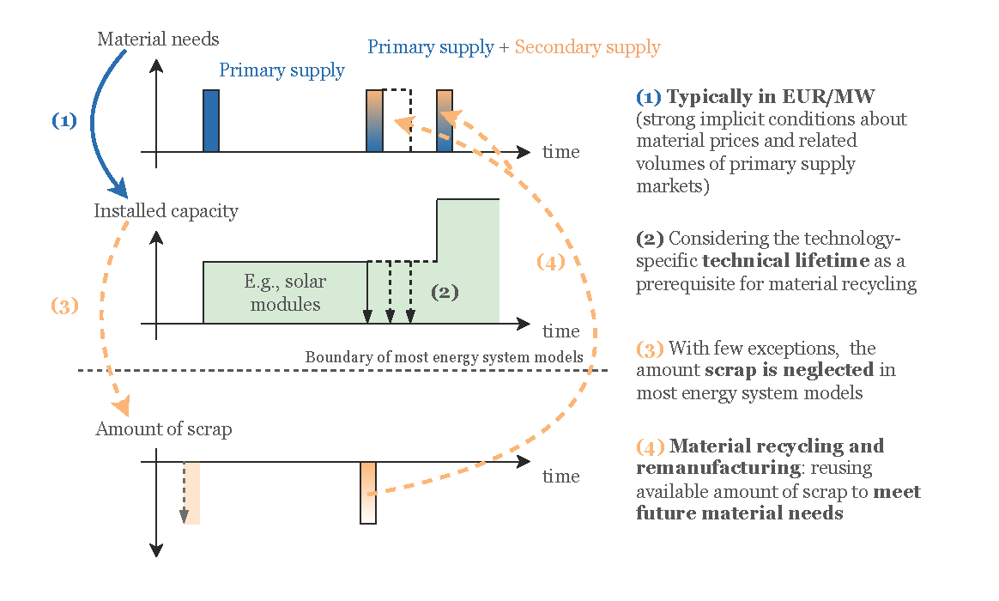

# Integrating material recycling and remanufacturing in energy system optimization modeling: A review and showcase

Copyright (c) 2024 Energy Economics Group (EEG), Technische Universität Wien, Sebastian Zwickl-Bernhard

This repository includes materials and methods of the paper published in _Advances in Applied Energy_.

## Overview & Abstract
This paper addresses the currently overlooked yet urgent topic of material recycling and remanufacturing in energy system optimization modeling, making three substantial contributions. First, it presents a comprehensive review of relevant studies on material demand, flows, and recycling from a techno-economic perspective and highlights the critical gap in existing energy system optimization models, in which material recycling and remanufacturing is not yet adequately integrated. Second, the paper introduces a general mathematical framework for incorporating material recycling and remanufacturing as a technology and investment option into typical energy system optimization models. Third, the paper demonstrates the practical application of this framework by examining the material recycling potential within the solar module expansion plan of the European Union. It explores the main drivers under which material recycling becomes economically competitive, considering various global and regional solar market conditions. Specifically, it investigates how different energy policies — such as incentivizing European Union manufacturing, limiting import shares, and implementing a circular economy constraint — affect the optimal remanufacturing capacities and achievable shares of recycling-based additions to meet the expansion targets until 2050.

	

